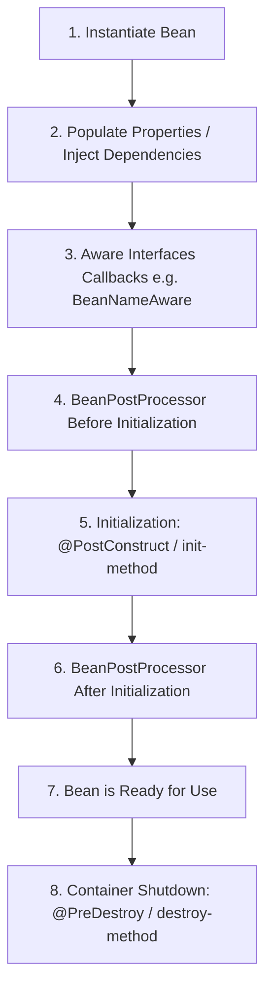

# Bean Scopes, Lifecycle, & Circular Dependencies

This note covers bean creation behavior, lifecycle hooks, scopes, and managing circular dependencies in Spring.

---

## 1. Bean Scopes

A bean's scope defines its lifecycle and how many instances of that bean are created by the IoC container.

### Core Scopes (Available in all environments)
1. **`singleton`** (Default): The container creates exactly **one instance** of the bean. All requests and injections of this bean resolve to the same shared object. Singleton beans are thread-shared.
2. **`prototype`**: The container creates a **new instance** every time the bean is requested (via code or injected into another bean).

### Web Scopes (Only available in web-aware ApplicationContext)
3. **`request`**: Creates a single bean instance per HTTP request. Active only in web apps.
4. **`session`**: Creates a single bean instance per HTTP session.
5. **`application`**: Creates a single bean instance per Lifecycle of a `ServletContext`.
6. **`websocket`**: Creates a single bean instance per WebSocket lifecycle.

### Setting Scopes
Use the `@Scope` annotation alongside `@Component` or `@Bean`:
```java
@Service
@Scope("prototype") // or ConfigurableBeanFactory.SCOPE_PROTOTYPE
public class TaskExecutorService { ... }
```

---

## 2. Eager vs. Lazy Beans

By default, Singleton beans are **eagerly initialized** at application startup. This is beneficial because configuration errors or missing dependencies are caught immediately at startup.

### Lazy Initialization (`@Lazy`)
If a bean is annotated with `@Lazy`, Spring will **not** instantiate it at startup. Instead, it will create a lightweight dynamic proxy and instantiate the real bean only when:
- It is explicitly requested from the context.
- It is first injected into another active bean.

```java
@Service
@Lazy
public class HeavyReportService {
    public HeavyReportService() {
        System.out.println("HeavyReportService instantiated!");
    }
}
```
*Note*: If an eager bean depends on a `@Lazy` bean, the lazy bean will still be initialized at startup because the eager bean requires it during its own injection phase.

---

## 3. Circular Dependency

A circular dependency occurs when Bean A depends on Bean B, and Bean B depends on Bean A:
$$\text{Bean A} \rightarrow \text{Bean B} \rightarrow \text{Bean A}$$

### Constructor Injection Circularity
If you use constructor injection, Spring will fail at startup and throw a `BeanCurrentlyInCreationException`. This is because Spring cannot resolve the parameters to construct either object.

### How to Resolve Circular Dependencies:
1. **Redesign the Code (Best Practice)**: Extract the common functionality to a third bean (Bean C) that both A and B depend on, breaking the circle.
2. **Use `@Lazy`**: Annotate one of the constructor parameters with `@Lazy`. This tells Spring to inject a proxy first, and resolve the actual bean later when needed.
   ```java
   @Component
   public class BeanA {
       private final BeanB beanB;
       public BeanA(@Lazy BeanB beanB) {
           this.beanB = beanB;
       }
   }
   ```
3. **Setter or Field Injection**: Spring can instantiate Bean A and Bean B using their default constructors first, and then inject the properties later. However, this is discouraged as it hides structural flaws.

---

## 4. Bean Lifecycle

The lifecycle of a Spring Bean consists of instantiation, configuration, initialization, usage, and destruction.



### Lifecycle Callback Hooks
You can tap into bean initialization and destruction phases using the following methods:

#### A. Annotations (Recommended)
- **`@PostConstruct`**: Executed immediately after dependency injection is complete, and before the bean is put into service. Used for setup logic.
- **`@PreDestroy`**: Executed just before the bean is destroyed by the container. Used for cleanup (closing sockets, DB connections, releasing resources).

```java
import jakarta.annotation.PostConstruct;
import jakarta.annotation.PreDestroy;
import org.springframework.stereotype.Component;

@Component
public class DatabaseConnectionManager {

    @PostConstruct
    public void init() {
        System.out.println("Connection pool initialized after injection.");
    }

    @PreDestroy
    public void cleanup() {
        System.out.println("Connection pool closed before destruction.");
    }
}
```

#### B. Interfaces
- Implementing `InitializingBean` (implements `afterPropertiesSet()`)
- Implementing `DisposableBean` (implements `destroy()`)
*Note*: This couples your code directly to the Spring framework, so annotations are preferred.

#### C. Custom init-method and destroy-method
- Defined in XML configuration or as properties of the `@Bean(initMethod = "...", destroyMethod = "...")` annotation.
