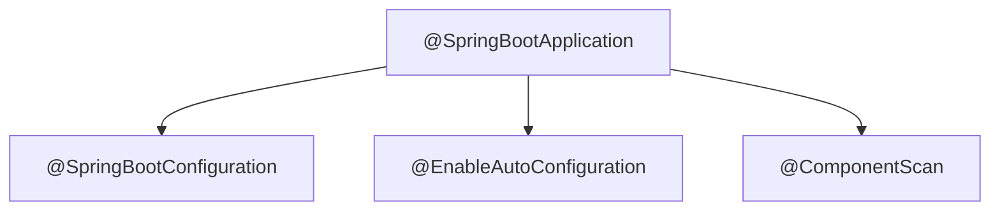
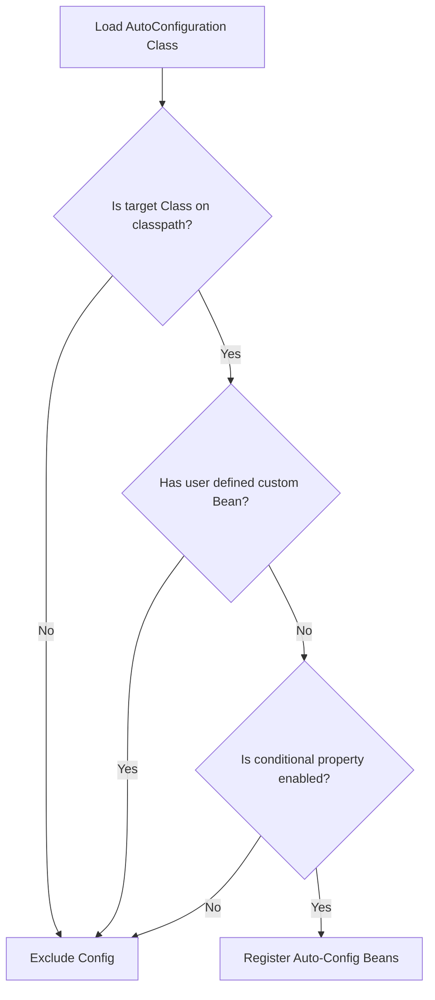

[← Back to Master README](file:///Users/anurag/Desktop/crudSpingBootDemo/README.md)

# Spring Boot Core & Auto-Configuration

This note covers the bootstrap entry point of a Spring Boot application and how auto-configuration works under the hood.

---

## 1. The `@SpringBootApplication` Annotation

Every Spring Boot application begins with a main class annotated with `@SpringBootApplication`. In our project, this is [CrudSpingBootDemoApplication.java](file:///Users/anurag/Desktop/crudSpingBootDemo/src/main/java/in/anurag/crudSpingBootDemo/CrudSpingBootDemoApplication.java).

```java
package in.anurag.crudSpingBootDemo;

import org.springframework.boot.SpringApplication;
import org.springframework.boot.autoconfigure.SpringBootApplication;

@SpringBootApplication
public class CrudSpingBootDemoApplication {
    public static void main(String[] args) {
        SpringApplication.run(CrudSpingBootDemoApplication.class, args);
    }
}
```

The `@SpringBootApplication` is a **meta-annotation** that combines three core annotations:



1. **`@SpringBootConfiguration`**:
   - A specialization of `@Configuration`. Marks this class as a source of bean definitions.
2. **`@ComponentScan`**:
   - Directs Spring to scan the package containing this class and all its sub-packages (e.g., `in.anurag.crudSpingBootDemo.*`) for annotations like `@Component`, `@Service`, `@Repository`, and `@RestController`.
3. **`@EnableAutoConfiguration`**:
   - The magic switch that instructs Spring Boot to automatically configure beans that are likely needed, based on classpath dependencies.

---

## 2. Auto-Configuration Mechanism

### How does `@EnableAutoConfiguration` work?

1. At startup, Spring Boot looks inside external jar libraries for configuration imports.
2. In Spring Boot 3.x, it scans `META-INF/spring/org.springframework.boot.autoconfigure.AutoConfiguration.imports` inside starter dependencies. (In legacy Spring Boot 2.x, it scanned `META-INF/spring.factories`).
3. These files contain lists of fully-qualified configuration classes (e.g., `org.springframework.boot.autoconfigure.jdbc.DataSourceAutoConfiguration`).
4. Spring Boot loads these classes and evaluates conditional annotations to decide whether to register their beans.

---

## 3. Conditional Annotations (The Building Blocks)

Spring Boot uses `@Conditional` annotations to determine if an auto-configuration class should run. This prevents unnecessary bean creation and allows developers to override defaults.

- **`@ConditionalOnClass`**: Configures a bean only if a specific class is present on the classpath.
  - *Example*: WebMvcAutoConfiguration is enabled only if `DispatcherServlet.class` is on the classpath.
- **`@ConditionalOnMissingClass`**: Enabled only if a specific class is not present.
- **`@ConditionalOnBean`**: Enabled only if a bean of a specific type already exists in the context.
- **`@ConditionalOnMissingBean`**: Enabled only if the developer has **not** defined a custom bean of this type. This is how Spring Boot lets you override its defaults.
  - *Example*: Spring Boot configures a default `ObjectMapper` bean *only if* you haven't declared one yourself.
- **`@ConditionalOnProperty`**: Enabled only if a specific configuration property is present and has a specific value.
- **`@ConditionalOnWebApplication`**: Enabled only if the application is a web application.

### Visualizing Auto-Configuration Decision Tree:




[← Back to Master README](file:///Users/anurag/Desktop/crudSpingBootDemo/README.md)
