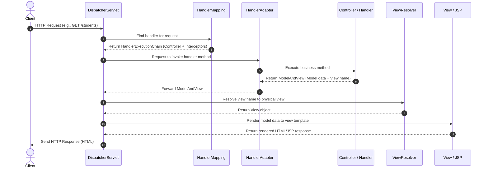
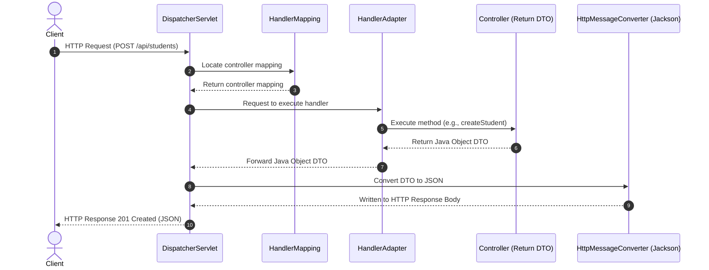

[← Back to Master README](file:///Users/anurag/Desktop/crudSpingBootDemo/README.md)

# Java Web App Architecture & Spring MVC

This note explains how Java web applications function under the hood, comparing traditional servlet setups with modern Spring Boot embedded Tomcat, and detailing the Spring MVC request lifecycle.

---

## 1. How Java Web Apps Actually Work

Traditional Java web applications rely on Servlets, Web Containers, and packaging formats like WAR.

### A. What is a Servlet?
A **Servlet** is a Java class that extends the capabilities of a server to host applications accessed via a request-response model. It implements the `jakarta.servlet.Servlet` interface (historically `javax.servlet.Servlet`).
- **Servlet Lifecycle**:
  1. `init()`: Called once when the container loads the servlet.
  2. `service()`: Called for each HTTP request. It dispatches requests to `doGet()`, `doPost()`, etc.
  3. `destroy()`: Called when the servlet is taken out of service.

### B. The Servlet Container (Web Container)
An application server like **Apache Tomcat** acts as a servlet container. Its jobs include:
- Managing the lifecycle of servlets.
- Mapping incoming request URLs to specific servlets.
- Handling concurrent requests by spawning new threads.

### C. WAR vs. JAR Packaging
- **WAR (Web Archive)**: A file structure containing compiled servlet classes, dependencies, assets, and web configuration files (`web.xml`). It must be deployed into a separately installed servlet container (Tomcat) running on the server machine.
- **Fat JAR (Spring Boot default)**: A standalone executable containing all class files, library dependencies, AND an **embedded Tomcat servlet container**. It can be run simply using `java -jar app.jar`.

---

## 2. Spring MVC Architecture

Spring MVC (Model-View-Controller) is built around a central servlet called the **`DispatcherServlet`** which acts as the **Front Controller** pattern.

### The Spring MVC Request Flow

### The REST API Request Flow (Modern Web/Spring Boot)
In RESTful web services (where controllers are annotated with `@RestController`), the `ViewResolver` and `View` stages are bypassed:

- **`HttpMessageConverter`**: Spring Boot automatically configures message converters. When a controller method returns a Java object (e.g., `CreateStudentResponseDTO`), the `MappingJackson2HttpMessageConverter` converts the object into a JSON string and writes it directly to the response body.

[← Back to Master README](file:///Users/anurag/Desktop/crudSpingBootDemo/README.md)
