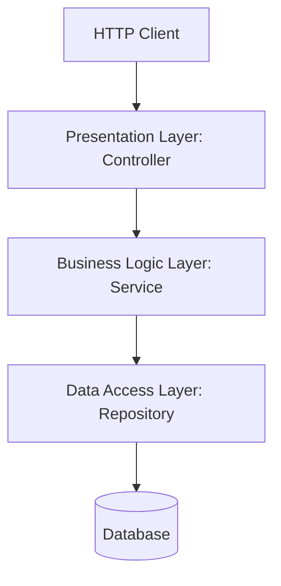

# CRUD Architecture, JPA, & Soft Delete

This note documents the 3-Tier Layered Architecture of Spring Boot enterprise applications, Spring Data JPA mechanisms, and soft delete logic.

---

## 1. The 3-Tier Layered Architecture

To achieve separation of concerns, enterprise applications are split into three logical layers:



### A. Presentation Layer (Controllers)
- **Role**: Intercept HTTP requests, parse and validate input data, format HTTP status codes, and return responses.
- **Reference**: [StudentController.java](file:///Users/anurag/Desktop/crudSpingBootDemo/src/main/java/in/anurag/crudSpingBootDemo/controller/StudentController.java)

### B. Business Logic Layer (Services)
- **Role**: Execute core business validations, manage transactions, perform DTO-to-Entity mappings, and coordinate database queries.
- **Reference**: [StudentService.java](file:///Users/anurag/Desktop/crudSpingBootDemo/src/main/java/in/anurag/crudSpingBootDemo/service/StudentService.java)

### C. Data Access Layer (Repositories)
- **Role**: Interface with the underlying database to perform persistence operations.
- **Reference**: [StudentRepository.java](file:///Users/anurag/Desktop/crudSpingBootDemo/src/main/java/in/anurag/crudSpingBootDemo/repository/StudentRepository.java)

---

## 2. Spring Data JPA & Entity Configurations

Spring Data JPA is built on top of JPA (Jakarta Persistence API) and Hibernate. By extending `JpaRepository`, Spring dynamically implements standard CRUD operations at runtime.

### JPA Entity Annotations:
- **`@Entity`**: Marks the Java class as a persistent database entity mapping to a database table.
- **`@Id`**: Marks the primary key field.
- **`@GeneratedValue(strategy = GenerationType.IDENTITY)`**: Configures auto-increment primary key generation.

### Derived Query Methods
Spring parses method names in repository interfaces and translates them into SQL queries automatically. For example, in [StudentRepository.java](file:///Users/anurag/Desktop/crudSpingBootDemo/src/main/java/in/anurag/crudSpingBootDemo/repository/StudentRepository.java):
```java
// Spring generates: SELECT count(*) > 0 FROM student WHERE email = ?
Boolean existsByEmail(String email);
```

---

## 3. Implementing Soft Delete in Spring

### What is Soft Delete?
Instead of executing a SQL `DELETE` statement which permanently removes a row from the database, **Soft Delete** sets a flag (e.g., `deleted = true`) to mark the record as inactive while keeping the data intact for auditing or recovery.

### Code Walkthrough of Soft Delete in our Project:

#### 1. Entity Field Definition
In [Student.java](file:///Users/anurag/Desktop/crudSpingBootDemo/src/main/java/in/anurag/crudSpingBootDemo/entity/Student.java), we declare a boolean field `deleted`:
```java
private Boolean deleted;
```

#### 2. Filtering Inactive Records in Repository
In [StudentRepository.java](file:///Users/anurag/Desktop/crudSpingBootDemo/src/main/java/in/anurag/crudSpingBootDemo/repository/StudentRepository.java), we define custom methods that ignore records where `deleted` is true:
```java
@Repository
public interface StudentRepository extends JpaRepository<Student, Long> {
    Optional<Student> findByIdAndDeletedIsFalse(Long id);
    List<Student> findByDeletedIsFalse();
    Boolean existsByEmail(String email);
}
```

#### 3. Soft Delete Operation in Service
In [StudentService.java](file:///Users/anurag/Desktop/crudSpingBootDemo/src/main/java/in/anurag/crudSpingBootDemo/service/StudentService.java#L57-L64), instead of invoking `studentRepository.delete(student)`, we set the `deleted` flag to `true` and save the changes:
```java
public void deleteStudentSoftly(Long id){
    // Locate the active student
    Student foundStudent = studentRepository
            .findByIdAndDeletedIsFalse(id)
            .orElseThrow(() -> new ResourceNotFoundException("Student with id " + id + " not found"));

    // Modify flag (Soft Delete)
    foundStudent.setDeleted(true);
    studentRepository.save(foundStudent);
}
```

#### 4. Controller Endpoint
In [StudentController.java](file:///Users/anurag/Desktop/crudSpingBootDemo/src/main/java/in/anurag/crudSpingBootDemo/controller/StudentController.java), we map the DELETE operation:
```java
@DeleteMapping("/{id}")
public ResponseEntity<String> deleteStudent(@PathVariable Long id) {
    studentService.deleteStudentSoftly(id);
    return ResponseEntity.ok("Student deleted successfully");
}
```
*(Note: To enforce this transparently on all standard JPA methods, Hibernate provides `@SQLDelete(sql = "UPDATE student SET deleted = true WHERE id = ?")` and `@Where(clause = "deleted = false")` annotations. Using the custom repository methods approach, as done in this project, provides explicit control over when soft-delete queries are executed).*
