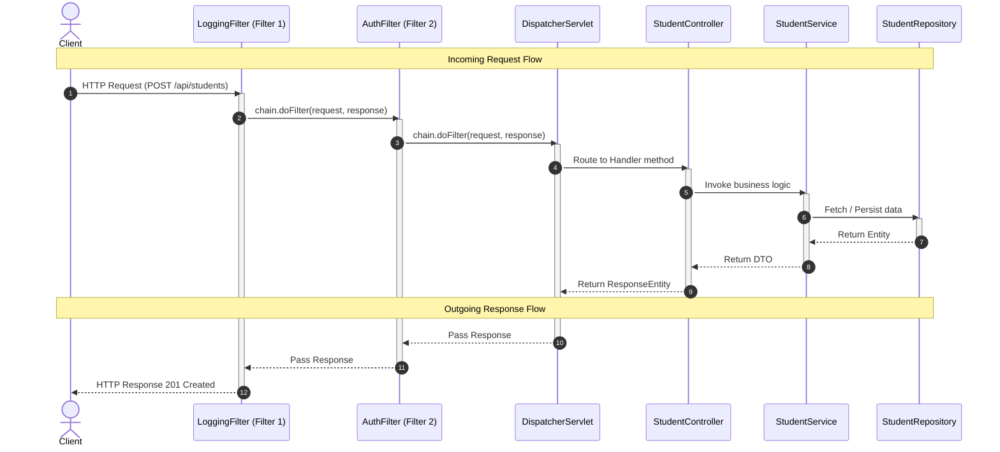

[← Back to Master README](../README.md)

# Spring Boot Filters & FilterChain

This note covers **Servlet Filters**, the **FilterChain**, request-response flows, and how to implement custom filters for Logging and Authentication in Spring Boot.

---

## 1. What is a Servlet Filter?

A **Filter** is an object that intercepts HTTP requests before they reach the servlet (e.g., `DispatcherServlet`) and modifies HTTP responses before they are sent back to the client.

Filters are part of the **Servlet Container** (like Tomcat), meaning they sit *outside* the Spring `ApplicationContext` MVC lifecycle. They are the first line of defense and processing for incoming requests.

```
Client  ───►  [Filter 1]  ───►  [Filter 2]  ───►  [DispatcherServlet]  ───►  [Controller]
                                                                                  │
                                                                                  ▼
Client  ◄───  [Filter 1]  ◄───  [Filter 2]  ◄───  [DispatcherServlet]  ◄───  [Service]
```

### Common Use Cases:
- **Authentication & Authorization**: Checking API keys or JWT tokens.
- **Logging & Auditing**: Tracking incoming request paths, HTTP methods, client IPs, and response execution time.
- **CORS Configuration**: Adding Cross-Origin Resource Sharing headers.
- **Data Compression**: Gzipping responses before sending them to the client.

---

## 2. The Filter Chain (Request & Response Flow)

Multiple filters form a **FilterChain**. Each filter has a chance to inspect the request/response and can decide to:
1. Pass the request/response to the next entity in the chain using `chain.doFilter(request, response)`.
2. Block the request and write a response directly (e.g., return `401 Unauthorized` if authentication fails).

### Request Flow Sequence

Here is the exact request flow from the client to the repository and back, showcasing where the filters intercept the request:



---

## 3. Implementing a Filter in Spring Boot

In Java, filters implement the `jakarta.servlet.Filter` interface, which defines three lifecycle methods:
- `init(FilterConfig)`: Called by the container during startup.
- `doFilter(ServletRequest, ServletResponse, FilterChain)`: The core method executed on every request.
- `destroy()`: Called when the filter is destroyed.

### A. Logging Filter Example
Below is an example of a filter that logs HTTP method, request URI, and processing time:

```java
import jakarta.servlet.*;
import jakarta.servlet.http.HttpServletRequest;
import jakarta.servlet.http.HttpServletResponse;
import org.slf4j.Logger;
import org.slf4j.LoggerFactory;
import org.springframework.core.annotation.Order;
import org.springframework.stereotype.Component;
import java.io.IOException;

@Component
@Order(1) // Executed first in the filter chain
public class LoggingFilter implements Filter {

    private static final Logger log = LoggerFactory.getLogger(LoggingFilter.class);

    @Override
    public void doFilter(ServletRequest request, ServletResponse response, FilterChain chain)
            throws IOException, ServletException {
        
        HttpServletRequest req = (HttpServletRequest) request;
        long startTime = System.currentTimeMillis();

        log.info("Incoming Request: {} {}", req.getMethod(), req.getRequestURI());

        // Pass to the next filter in the chain (or DispatcherServlet)
        chain.doFilter(request, response);

        long duration = System.currentTimeMillis() - startTime;
        HttpServletResponse res = (HttpServletResponse) response;
        log.info("Outgoing Response: {} (Took {}ms)", res.getStatus(), duration);
    }
}
```

### B. Authentication Filter Example
Below is an example of a filter that inspects an `Authorization` header and blocks requests returning a `401 Unauthorized` directly if missing or invalid:

```java
import jakarta.servlet.*;
import jakarta.servlet.http.HttpServletRequest;
import jakarta.servlet.http.HttpServletResponse;
import org.springframework.core.annotation.Order;
import org.springframework.stereotype.Component;
import java.io.IOException;

@Component
@Order(2) // Executed second in the filter chain
public class AuthFilter implements Filter {

    @Override
    public void doFilter(ServletRequest request, ServletResponse response, FilterChain chain)
            throws IOException, ServletException {
        
        HttpServletRequest req = (HttpServletRequest) request;
        HttpServletResponse res = (HttpServletResponse) response;
        
        String authHeader = req.getHeader("Authorization");

        // Bypass auth for public endpoints (like server-info)
        if (req.getRequestURI().contains("/server-info")) {
            chain.doFilter(request, response);
            return;
        }

        if (authHeader == null || !authHeader.startsWith("Bearer ")) {
            res.setStatus(HttpServletResponse.SC_UNAUTHORIZED);
            res.setContentType("application/json");
            res.getWriter().write("{\"error\": \"Unauthorized\", \"message\": \"Missing or invalid token\"}");
            return; // Terminate filter chain execution (does not call doFilter)
        }

        // Token validation logic...
        chain.doFilter(request, response);
    }
}
```

---

## 4. `OncePerRequestFilter`

By default, standard servlet filters can be invoked multiple times for a single request (e.g., during forward or error dispatches).

Spring provides a helper utility class called **`OncePerRequestFilter`**. If you extend this class instead of implementing `Filter`, Spring guarantees that the filter's logic is executed **exactly once** per request container thread.

```java
import org.springframework.web.filter.OncePerRequestFilter;
import jakarta.servlet.http.HttpServletRequest;
import jakarta.servlet.http.HttpServletResponse;
import jakarta.servlet.*;
import java.io.IOException;

public class CustomOncePerRequestFilter extends OncePerRequestFilter {
    @Override
    protected void doFilterInternal(HttpServletRequest request, HttpServletResponse response, FilterChain filterChain)
            throws ServletException, IOException {
        // Enforced execution logic exactly once
        filterChain.doFilter(request, response);
    }
}
```

[← Back to Master README](../README.md)
