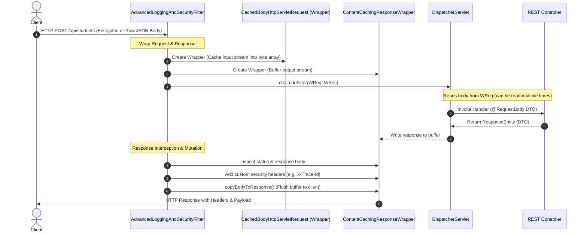

[← Back to Master README](../README.md)

# Spring Boot Filters: Modifying Requests, Responses, Headers & Bodies

This note covers advanced servlet filter techniques in Spring Boot, specifically addressing **The Stream Problem** (reading request bodies multiple times) and how to modify HTTP headers, request payloads, and response bodies using **`HttpServletRequestWrapper`** and **`HttpServletResponseWrapper`** (or Spring's `ContentCachingRequestWrapper` and `ContentCachingResponseWrapper`).

---

## 1. The Core Problem: The Servlet InputStream Stream Pitfall

In a standard Java Servlet container (like Apache Tomcat), the incoming HTTP request body is an `InputStream` (`ServletInputStream` returned by `request.getInputStream()`).

> [!WARNING]
> **Streams can only be read once!**
> Once a filter or interceptor reads `request.getInputStream()` to inspect or log the JSON body, the stream is consumed. When the request subsequently reaches Spring MVC's `DispatcherServlet` and the Jackson `HttpMessageConverter` tries to deserialize the `@RequestBody`, it encounters an empty stream and throws an `HttpMessageNotReadableException: Required request body is missing`.

```
Standard Request Stream:
Client ──► [Filter: reads InputStream] ──► [Stream is now EMPTY (EOF)] ──► [Controller: @RequestBody FAILS 💥]
```

### The Solution: Decorator Pattern with `HttpServletRequestWrapper`
To read or modify request and response bodies safely, Java Servlets provide wrapper classes based on the **Decorator Design Pattern**:
- `HttpServletRequestWrapper`
- `HttpServletResponseWrapper`

Spring Boot also provides built-in caching utilities:
- `ContentCachingRequestWrapper`
- `ContentCachingResponseWrapper`

---

## 2. Request & Response Modification Architecture

The following diagram illustrates how custom wrappers intercept, cache, and modify requests and responses throughout the filter chain:



---

## 3. Implementing a Re-Readable Request Wrapper

To inspect or modify request bodies, we create a subclass of `HttpServletRequestWrapper` that reads the original `InputStream` once, buffers it into a byte array, and returns a new `ServletInputStream` whenever `getInputStream()` is invoked.

### `CachedBodyHttpServletRequest.java`

```java
import jakarta.servlet.ReadListener;
import jakarta.servlet.ServletInputStream;
import jakarta.servlet.http.HttpServletRequest;
import jakarta.servlet.http.HttpServletRequestWrapper;
import org.springframework.util.StreamUtils;

import java.io.BufferedReader;
import java.io.ByteArrayInputStream;
import java.io.IOException;
import java.io.InputStreamReader;
import java.nio.charset.StandardCharsets;

public class CachedBodyHttpServletRequest extends HttpServletRequestWrapper {

    private final byte[] cachedBody;

    public CachedBodyHttpServletRequest(HttpServletRequest request) throws IOException {
        super(request);
        // Cache the incoming request stream into a byte array
        this.cachedBody = StreamUtils.copyToByteArray(request.getInputStream());
    }

    @Override
    public ServletInputStream getInputStream() {
        ByteArrayInputStream byteArrayInputStream = new ByteArrayInputStream(this.cachedBody);
        return new ServletInputStream() {
            @Override
            public boolean isFinished() {
                return byteArrayInputStream.available() == 0;
            }

            @Override
            public boolean isReady() {
                return true;
            }

            @Override
            public void setReadListener(ReadListener readListener) {
                // No-op for synchronous processing
            }

            @Override
            public int read() {
                return byteArrayInputStream.read();
            }
        };
    }

    @Override
    public BufferedReader getReader() {
        return new BufferedReader(new InputStreamReader(this.getInputStream(), StandardCharsets.UTF_8));
    }

    public byte[] getCachedBody() {
        return this.cachedBody;
    }
}
```

---

## 4. Modifying Request Headers (Custom Header Wrapper)

Servlet requests do not allow modifying headers directly (e.g., `request.setHeader()` does not exist). You must wrap the request to inject or alter headers:

```java
import jakarta.servlet.http.HttpServletRequest;
import jakarta.servlet.http.HttpServletRequestWrapper;
import java.util.*;

public class HeaderModifierRequestWrapper extends HttpServletRequestWrapper {

    private final Map<String, String> customHeaders = new HashMap<>();

    public HeaderModifierRequestWrapper(HttpServletRequest request) {
        super(request);
    }

    public void addHeader(String name, String value) {
        customHeaders.put(name, value);
    }

    @Override
    public String getHeader(String name) {
        String customValue = customHeaders.get(name);
        return (customValue != null) ? customValue : super.getHeader(name);
    }

    @Override
    public Enumeration<String> getHeaderNames() {
        Set<String> set = new HashSet<>(customHeaders.keySet());
        Enumeration<String> baseHeaders = super.getHeaderNames();
        while (baseHeaders.hasMoreElements()) {
            set.add(baseHeaders.nextElement());
        }
        return Collections.enumeration(set);
    }

    @Override
    public Enumeration<String> getHeaders(String name) {
        if (customHeaders.containsKey(name)) {
            return Collections.enumeration(Collections.singletonList(customHeaders.get(name)));
        }
        return super.getHeaders(name);
    }
}
```

---

## 5. Capturing & Modifying Response Headers & Bodies

To log or alter the response payload (for example, to inject an execution timestamp, sign the response, or calculate a checksum), wrap the response with Spring's `ContentCachingResponseWrapper`:

```java
import jakarta.servlet.FilterChain;
import jakarta.servlet.ServletException;
import jakarta.servlet.http.HttpServletRequest;
import jakarta.servlet.http.HttpServletResponse;
import org.slf4j.Logger;
import org.slf4j.LoggerFactory;
import org.springframework.core.annotation.Order;
import org.springframework.stereotype.Component;
import org.springframework.web.filter.OncePerRequestFilter;
import org.springframework.web.util.ContentCachingResponseWrapper;

import java.io.IOException;
import java.nio.charset.StandardCharsets;
import java.util.UUID;

@Component
@Order(1)
public class AdvancedRequestResponseFilter extends OncePerRequestFilter {

    private static final Logger log = LoggerFactory.getLogger(AdvancedRequestResponseFilter.class);

    @Override
    protected void doFilterInternal(HttpServletRequest request,
                                    HttpServletResponse response,
                                    FilterChain filterChain) throws ServletException, IOException {

        // 1. Wrap Request with custom cache & Header modifier
        CachedBodyHttpServletRequest wrappedRequest = new CachedBodyHttpServletRequest(request);
        
        // 2. Wrap Response with Spring's ContentCachingResponseWrapper
        ContentCachingResponseWrapper wrappedResponse = new ContentCachingResponseWrapper(response);

        String traceId = UUID.randomUUID().toString();
        wrappedResponse.setHeader("X-Trace-Id", traceId);

        // Read request payload safely
        String requestBody = new String(wrappedRequest.getCachedBody(), StandardCharsets.UTF_8);
        log.info("[Trace: {}] Incoming Request: {} {} | Body: {}", traceId, request.getMethod(), request.getRequestURI(), requestBody);

        long startTime = System.currentTimeMillis();
        try {
            // 3. Pass wrapped request and wrapped response through the filter chain
            filterChain.doFilter(wrappedRequest, wrappedResponse);
        } finally {
            long duration = System.currentTimeMillis() - startTime;
            
            // 4. Read response payload safely from wrapper buffer
            byte[] responseArray = wrappedResponse.getContentAsByteArray();
            String responseBody = new String(responseArray, StandardCharsets.UTF_8);
            
            log.info("[Trace: {}] Outgoing Response: Status {} (Took {}ms) | Body: {}", 
                     traceId, wrappedResponse.getStatus(), duration, responseBody);

            // 5. CRITICAL: Flush cached response back to actual client stream!
            wrappedResponse.copyBodyToResponse();
        }
    }
}
```

> [!CAUTION]
> **Must Call `copyBodyToResponse()`!**
> `ContentCachingResponseWrapper` intercepts the servlet output stream and writes all data into an internal buffer. If you do not call `copyBodyToResponse()` before the filter finishes, **the client will receive an empty (0 byte) HTTP response**!

---

## 6. Real-World Applications

| Use Case | Implementation Details |
| :--- | :--- |
| **Audit Logging** | Log raw JSON payloads for PCI-DSS/HIPAA compliance alongside user IDs. |
| **Payload Decryption** | Client transmits encrypted AES payload; filter decrypts payload in wrapper before Spring MVC deserializes it. |
| **Distributed Tracing** | Generate unique `X-Trace-Id` or `X-Correlation-Id` and propagate it to response headers. |
| **Response Tamper Protection** | Compute HMAC-SHA256 signature of response body and attach as an `X-Signature` header. |
| **Request Sanitization (XSS)** | Strip `<script>` tags or malicious HTML from incoming JSON/form fields. |

---

[← Back to Master README](../README.md)
