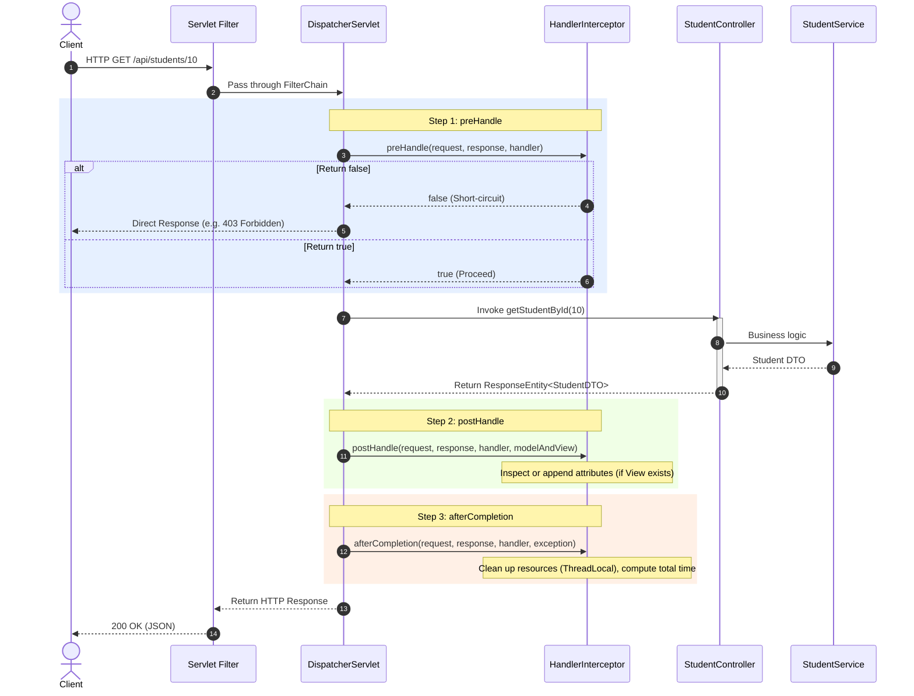

[← Back to Master README](../README.md)

# Spring Boot Interceptors: preHandle, postHandle & afterCompletion

This note covers **Spring MVC HandlerInterceptors**, their lifecycle hooks (`preHandle`, `postHandle`, `afterCompletion`), differences between Filters and Interceptors, and how to register and configure interceptor chains.

---

## 1. What is a Spring MVC Interceptor?

An **Interceptor** in Spring MVC intercepts incoming HTTP requests **after** they pass through the servlet filter chain and reach the `DispatcherServlet`, but **before** they reach the `@Controller` or `@RestController`.

Interceptors implement the `org.springframework.web.servlet.HandlerInterceptor` interface and are native to the Spring Framework context.

```
Client ──► [Servlet Filters] ──► [DispatcherServlet] ──► [Interceptor (preHandle)] ──► [@RestController]
                                                                                            │
Client ◄── [Servlet Filters] ◄── [DispatcherServlet] ◄── [Interceptor (afterCompletion)] ◄──┘
```

---

## 2. Key Differences: Servlet Filter vs Spring Interceptor

| Feature | Servlet Filter | Spring HandlerInterceptor |
| :--- | :--- | :--- |
| **Origin / Spec** | Jakarta Servlet Specification (Tomcat, Jetty) | Spring MVC Framework |
| **Invocation Boundary** | Outside Spring MVC (`DispatcherServlet`) | Inside Spring MVC (`DispatcherServlet`) |
| **Handler Awareness** | Blind to target controller; only sees raw request/response | Has direct access to target `HandlerMethod` (controller class, method annotations, parameter types) |
| **Payload Wrapping** | Can wrap request/response (`HttpServletRequestWrapper`) to alter input stream | Cannot easily wrap request/response bodies |
| **Exceptions** | Bypasses Spring `@ExceptionHandler` advice | Exceptions trigger `afterCompletion()` and can be captured by `@ControllerAdvice` |
| **Common Use Cases** | CORS, Gzip compression, request/response caching, low-level security | Auth token validation, Controller method performance metrics, logging route parameters, user session tracking |

---

## 3. The Interceptor Lifecycle & Sequence

Spring MVC executes the interceptor hooks in a strict sequence:



---

## 4. The Three Lifecycle Methods Explained

### 1. `preHandle(HttpServletRequest request, HttpServletResponse response, Object handler)`
- **When it runs**: Before the controller method executes.
- **Return Type**: `boolean`
  - `true`: Request proceeds to the next interceptor or the controller method.
  - `false`: Processing is terminated immediately (**short-circuited**). You are responsible for writing an HTTP response (e.g., status 401 or 403).
- **Handler Argument**: Castable to `HandlerMethod` to inspect controller class, annotations, and methods.

### 2. `postHandle(HttpServletRequest request, HttpServletResponse response, Object handler, ModelAndView modelAndView)`
- **When it runs**: After the controller executes, but before the view is rendered (in traditional MVC).
- **Note for REST APIs**: When using `@RestController`, the response body is written directly by `HttpMessageConverter` before `postHandle` is reached. In this case, `modelAndView` will be `null`.
- **Note on Exceptions**: If the controller throws an unhandled exception, `postHandle` is skipped!

### 3. `afterCompletion(HttpServletRequest request, HttpServletResponse response, Object handler, Exception ex)`
- **When it runs**: After the entire request cycle is complete (including response writing and view rendering).
- **Guaranteed Execution**: If `preHandle()` returned `true`, `afterCompletion()` is **always executed**, even if the controller or service threw an unhandled exception.
- **Primary Use**: Cleaning up `ThreadLocal` variables to prevent memory leaks in thread pools, and calculating accurate execution durations.

---

## 5. Implementation Example: Performance & Controller Auditing

### Step A: Define the Interceptor

```java
import jakarta.servlet.http.HttpServletRequest;
import jakarta.servlet.http.HttpServletResponse;
import org.slf4j.Logger;
import org.slf4j.LoggerFactory;
import org.springframework.stereotype.Component;
import org.springframework.web.method.HandlerMethod;
import org.springframework.web.servlet.HandlerInterceptor;
import org.springframework.web.servlet.ModelAndView;

@Component
public class ExecutionTimeInterceptor implements HandlerInterceptor {

    private static final Logger log = LoggerFactory.getLogger(ExecutionTimeInterceptor.class);
    private static final String START_TIME_ATTR = "startTime";

    @Override
    public boolean preHandle(HttpServletRequest request, HttpServletResponse response, Object handler) throws Exception {
        long startTime = System.currentTimeMillis();
        request.setAttribute(START_TIME_ATTR, startTime);

        if (handler instanceof HandlerMethod handlerMethod) {
            String controllerName = handlerMethod.getBeanType().getSimpleName();
            String methodName = handlerMethod.getMethod().getName();
            log.info("▶ [Interceptor] Target Controller: {}#{}()", controllerName, methodName);
        }

        return true; // Continue execution chain
    }

    @Override
    public void postHandle(HttpServletRequest request, HttpServletResponse response, Object handler, ModelAndView modelAndView) {
        log.info("▷ [Interceptor] postHandle invoked (Controller finished)");
    }

    @Override
    public void afterCompletion(HttpServletRequest request, HttpServletResponse response, Object handler, Exception ex) {
        Long startTime = (Long) request.getAttribute(START_TIME_ATTR);
        if (startTime != null) {
            long duration = System.currentTimeMillis() - startTime;
            log.info("◀ [Interceptor] Completed: {} {} (Status: {}, Duration: {}ms)", 
                     request.getMethod(), request.getRequestURI(), response.getStatus(), duration);
        }

        if (ex != null) {
            log.error("💥 [Interceptor] Uncaught Exception detected: {}", ex.getMessage());
        }
    }
}
```

---

## 6. Registering Interceptors with `WebMvcConfigurer`

In Spring Boot, interceptors must be registered with the MVC configuration registry:

```java
import org.springframework.context.annotation.Configuration;
import org.springframework.web.servlet.config.annotation.InterceptorRegistry;
import org.springframework.web.servlet.config.annotation.WebMvcConfigurer;

@Configuration
public class WebMvcConfig implements WebMvcConfigurer {

    private final ExecutionTimeInterceptor executionTimeInterceptor;

    public WebMvcConfig(ExecutionTimeInterceptor executionTimeInterceptor) {
        this.executionTimeInterceptor = executionTimeInterceptor;
    }

    @Override
    public void addInterceptors(InterceptorRegistry registry) {
        registry.addInterceptor(executionTimeInterceptor)
                .addPathPatterns("/api/**")              // Apply to all API routes
                .excludePathPatterns("/api/public/**",   // Exclude public routes
                                     "/swagger-ui/**",
                                     "/v3/api-docs/**");
    }
}
```

---

## 7. Multiple Interceptors: Execution Ordering

When multiple interceptors are registered:
1. `preHandle` runs in **registration order** (Interceptor 1 ➔ Interceptor 2).
2. `postHandle` runs in **reverse order** (Interceptor 2 ➔ Interceptor 1).
3. `afterCompletion` runs in **reverse order** (Interceptor 2 ➔ Interceptor 1).

```
Incoming Request:
   Interceptor 1: preHandle()
      Interceptor 2: preHandle()
         ► Controller Method Execution
      Interceptor 2: postHandle()
   Interceptor 1: postHandle()
Outgoing Response:
      Interceptor 2: afterCompletion()
   Interceptor 1: afterCompletion()
```

---

[← Back to Master README](../README.md)
