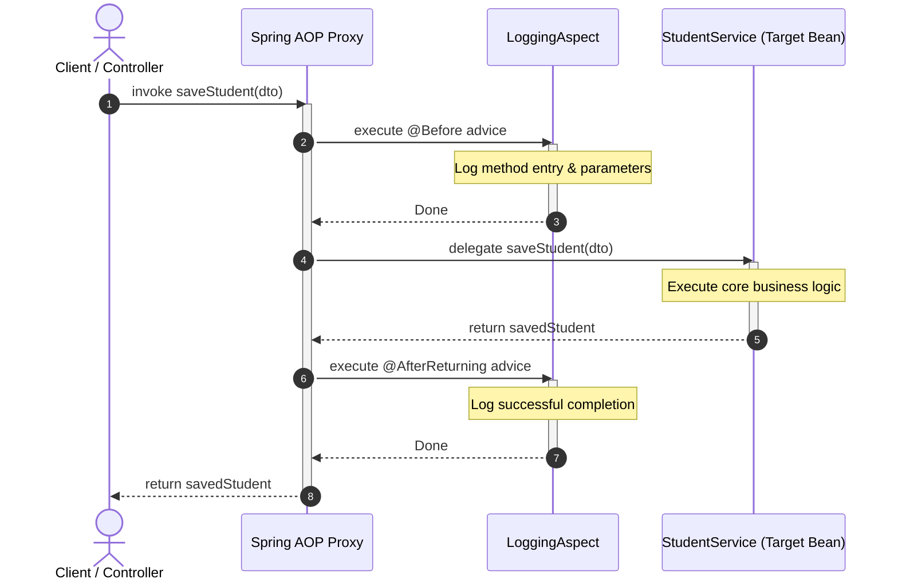

[← Back to Master README](../README.md)

# Spring AOP: Cross-Cutting Concerns & Proxies

This note introduces **Aspect-Oriented Programming (AOP)** in Spring Boot, explaining how to decouple secondary **cross-cutting concerns** from core business logic using runtime **Dynamic Proxies**.

---

## 1. What is Aspect-Oriented Programming (AOP)?

In Object-Oriented Programming (OOP), the key unit of modularity is the **Class**. However, real-world enterprise applications have common requirements that cut across multiple classes and layers (e.g., logging, security, metrics, transaction management).

When implemented using pure OOP, these requirements lead to two major architectural antipatterns:
1. **Code Tangling**: Business methods become cluttered with unrelated logic (e.g., a banking transfer method containing 10 lines of logging and metrics for every 2 lines of transfer logic).
2. **Code Scattering**: The exact same boilerplate code is duplicated across dozens or hundreds of methods in controllers, services, and repositories.

**AOP** complements OOP by providing another way of thinking about program structure. The key unit of modularity in AOP is the **Aspect**, which encapsulates behaviors that cut across multiple classes.

```mermaid
graph TD
    subgraph Without AOP (Tangled and Scattered)
        C1[Controller 1] --> L1[Logging]
        C1 --> S1[Security]
        C1 --> T1[Transactions]
        C2[Controller 2] --> L2[Logging]
        C2 --> S2[Security]
        C2 --> T2[Transactions]
        SV1[Service Layer] --> L3[Logging]
        SV1 --> T3[Transactions]
    end

    subgraph With AOP (Clean & Modular)
        A1[Controller 1]
        A2[Controller 2]
        A3[Service Layer]
        
        ASP_L[Aspect: Logging] -. Intercepts .-> A1
        ASP_L -. Intercepts .-> A2
        ASP_L -. Intercepts .-> A3
        
        ASP_T[Aspect: Transactions] -. Intercepts .-> A3
        ASP_S[Aspect: Security] -. Intercepts .-> A1
        ASP_S -. Intercepts .-> A2
    end
```

---

## 2. Core AOP Terminology

Understanding AOP requires learning its foundational vocabulary:

| Term | Concept | Plain English Analogy |
| :--- | :--- | :--- |
| **Aspect** | A modular class encapsulating a cross-cutting concern (annotated with `@Aspect`). | The Security Department of an office building. |
| **Join Point** | A specific point during execution (e.g., a method invocation). In Spring AOP, a join point is **always a method execution**. | The security gate at the building entrance. |
| **Advice** | The action taken by an aspect at a particular join point (`@Before`, `@After`, `@Around`, etc.). | The security guard checking your badge or recording your name. |
| **Pointcut** | A predicate expression that matches join points (specifies *where* advice should be applied). | The rule: "Check badges for anyone entering the 5th floor." |
| **Target Object** | The actual business object being advised (e.g., `StudentService`). | The employee being checked at the gate. |
| **AOP Proxy** | An intermediate object generated by the framework that wraps the target object to invoke advice. | The security checkpoint itself through which the employee must pass. |
| **Weaving** | The process of linking aspects with target objects to create advised proxy objects. Spring AOP performs weaving at **Runtime**. | Setting up the turnstiles and guards during building operation. |

---

## 3. How Spring AOP Works: The Dynamic Proxy Pattern

Spring AOP is **proxy-based**. When you annotate a Spring bean with an aspect, Spring does not modify your compiled bytecode directly. Instead:

1. Spring IoC container creates a **Proxy** object that wraps your original bean.
2. When another bean calls a method on the advised bean, it actually calls the **Proxy**.
3. The Proxy executes the configured Aspect Advice.
4. The Proxy then delegates the call to the actual target method.
5. The Proxy captures return values or exceptions, executes post-advice, and returns the result to the caller.



---

## 4. Setting Up Spring Boot AOP

To enable Spring AOP in your Spring Boot application, add the starter dependency to `pom.xml`:

```xml
<dependency>
    <groupId>org.springframework.boot</groupId>
    <artifactId>spring-boot-starter-aop</artifactId>
</dependency>
```

> [!NOTE]
> Spring Boot auto-configures `@EnableAspectJAutoProxy(proxyTargetClass = true)` by default, enabling AspectJ annotation processing and CGLIB proxying out of the box.

---

## 5. An Introductory Aspect Example

Here is a minimal aspect that logs every service method execution:

```java
import org.aspectj.lang.JoinPoint;
import org.aspectj.lang.annotation.Aspect;
import org.aspectj.lang.annotation.Before;
import org.slf4j.Logger;
import org.slf4j.LoggerFactory;
import org.springframework.stereotype.Component;

@Aspect
@Component
public class SimpleLoggingAspect {

    private static final Logger log = LoggerFactory.getLogger(SimpleLoggingAspect.class);

    // Pointcut expression matching any method in the service package
    @Before("execution(* in.anurag.crudSpingBootDemo.service.*.*(..))")
    public void logBeforeServiceMethod(JoinPoint joinPoint) {
        String methodName = joinPoint.getSignature().getName();
        String className = joinPoint.getTarget().getClass().getSimpleName();
        log.info("▶ [AOP Interception] Executing: {}.{}()", className, methodName);
    }
}
```

---

[← Back to Master README](../README.md)
