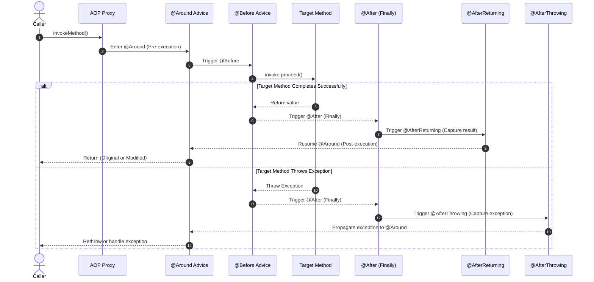

[← Back to Master README](../README.md)

# Spring AOP Advice Types: @Before, @After, @Around

This note explores the **5 Advice Types** in Spring AOP, detailing their execution lifecycle, parameters, exception semantics, and practical real-world implementations.

---

## 1. Overview of the 5 Advice Types

An **Advice** defines **what** action an aspect executes and **when** it triggers relative to the target method invocation.

| Advice Annotation | When Executed | Can Stop Execution? | Can Modify Return Value? |
| :--- | :--- | :--- | :--- |
| **`@Before`** | Before target method begins | Only by throwing exception | No |
| **`@AfterReturning`** | After target method finishes successfully | No | No (can inspect) |
| **`@AfterThrowing`** | Only if target method throws an exception | No | No (can inspect / rethrow) |
| **`@After`** (Finally) | Always after method ends (success OR exception) | No | No |
| **`@Around`** | Surrounds target method (most powerful) | Yes (can skip `proceed()`) | **Yes** (can replace return value) |

---

## 2. Advice Execution Lifecycle Diagram



---

## 3. Detailed Implementations & Examples

### 1. `@Before` Advice
Executed prior to the method invocation. Ideal for parameter validation, security checks, and logging incoming requests.

```java
@Before("execution(* in.anurag.crudSpingBootDemo.service.StudentService.getStudentById(..)) && args(id)")
public void logBeforeGetStudent(JoinPoint joinPoint, Long id) {
    log.info("▶ [@Before] Fetching student with ID: {}", id);
    if (id <= 0) {
        throw new IllegalArgumentException("Student ID must be a positive integer!");
    }
}
```

---

### 2. `@AfterReturning` Advice
Runs only when the target method terminates without uncaught exceptions. It provides access to the returned object via the `returning` attribute.

```java
@AfterReturning(
    pointcut = "execution(* in.anurag.crudSpingBootDemo.service.StudentService.createStudent(..))",
    returning = "result"
)
public void logAfterSuccessfulCreation(JoinPoint joinPoint, Object result) {
    log.info("✔ [@AfterReturning] Method {} executed successfully. Returned payload: {}", 
             joinPoint.getSignature().getName(), result);
}
```

---

### 3. `@AfterThrowing` Advice
Executes only when an uncaught exception is thrown by the target method. Provides access to the exception instance via the `throwing` attribute.

```java
@AfterThrowing(
    pointcut = "execution(* in.anurag.crudSpingBootDemo.service.*.*(..))",
    throwing = "ex"
)
public void logException(JoinPoint joinPoint, Throwable ex) {
    log.error("💥 [@AfterThrowing] Exception in {}: {} - Cause: {}",
              joinPoint.getSignature().toShortString(), ex.getClass().getSimpleName(), ex.getMessage());
}
```

---

### 4. `@After` (Finally) Advice
Runs unconditionally after the target method finishes—whether it succeeded or threw an exception (identical to a Java `finally` block). Typically used to release system resources, clear thread-local contexts, or reset flags.

```java
@After("execution(* in.anurag.crudSpingBootDemo.service.*.*(..))")
public void logFinally(JoinPoint joinPoint) {
    log.info("🏁 [@After] Target method invocation finished: {}", joinPoint.getSignature().getName());
}
```

---

### 5. `@Around` Advice: The Ultimate Swiss Army Knife

`@Around` advice gives you total control over target method execution. It requires a parameter of type **`ProceedingJoinPoint`**:
- Call `joinPoint.proceed()` to run the target method.
- Call `joinPoint.proceed(modifiedArgs)` to swap parameter values.
- Store and modify the return value.
- Catch exceptions to retry the invocation or return fallback data.

#### Execution Time Profiler with `@Around`:

```java
import org.aspectj.lang.ProceedingJoinPoint;
import org.aspectj.lang.annotation.Around;
import org.aspectj.lang.annotation.Aspect;
import org.slf4j.Logger;
import org.slf4j.LoggerFactory;
import org.springframework.stereotype.Component;

@Aspect
@Component
public class PerformanceTrackerAspect {

    private static final Logger log = LoggerFactory.getLogger(PerformanceTrackerAspect.class);

    @Around("execution(* in.anurag.crudSpingBootDemo.service.*.*(..))")
    public Object profileMethodExecution(ProceedingJoinPoint joinPoint) throws Throwable {
        long start = System.currentTimeMillis();
        String methodName = joinPoint.getSignature().toShortString();

        log.info("⏳ [@Around] Starting execution of: {}", methodName);

        try {
            // 1. Invoke the actual target method
            Object result = joinPoint.proceed();

            long duration = System.currentTimeMillis() - start;
            log.info("⏱ [@Around] Finished: {} in {}ms", methodName, duration);

            // 2. Return result (can alter or wrap if needed)
            return result;

        } catch (Throwable ex) {
            long duration = System.currentTimeMillis() - start;
            log.error("💥 [@Around] Failed: {} after {}ms with error: {}", methodName, duration, ex.getMessage());
            throw ex; // Re-throw to allow global exception handling
        }
    }
}
```

---

[← Back to Master README](../README.md)
