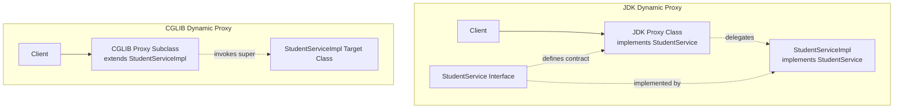

[← Back to Master README](../README.md)

# Spring AOP: Pointcuts & Types of Proxies

This note explores **Pointcut Expressions and Designators**, how to build reusable pointcut libraries, and the internal mechanics of **JDK Dynamic Proxies vs CGLIB Proxies**.

---

## 1. Pointcut Syntax & Designators

A **Pointcut** is a predicate expression that filters which join points (methods) will trigger an advice.

### Syntax Breakdown for `execution()`:
```
execution( [modifiers-pattern]?  [ret-type-pattern]  [declaring-type-pattern]? [name-pattern]([param-pattern])  [throws-pattern]? )
```

- `*`: Matches any return type or any single package/class/method identifier.
- `..`: In package patterns, matches zero or more subpackages. In parameter lists, matches zero or more arguments of any type.
- `+`: Matches any subtype/implementation of a class or interface.

### Common Pointcut Designators (PCDs):

| Designator | Description | Example |
| :--- | :--- | :--- |
| **`execution`** | Matches method signatures directly. | `execution(public * in.anurag..*Service.*(..))` |
| **`within`** | Limits matches to all join points inside matching classes or packages. | `within(in.anurag.crudSpingBootDemo.service..*)` |
| **`args`** | Matches methods where runtime argument types match specified classes. | `args(java.lang.Long, ..)` |
| **`@annotation`** | Matches methods annotated with a specific custom annotation. | `@annotation(in.anurag.annotation.TrackTime)` |
| **`@target`** | Matches classes annotated with a specific annotation. | `@target(org.springframework.stereotype.Service)` |
| **`bean`** | Matches Spring beans by bean name or pattern. | `bean(*ServiceImpl)` |

---

## 2. Reusable Pointcut Architecture

Rather than inlining raw strings in every advice annotation, define modular, reusable pointcut methods:

```java
import org.aspectj.lang.annotation.Aspect;
import org.aspectj.lang.annotation.Pointcut;

@Aspect
public class CommonPointcuts {

    // Matches all methods in the controller package
    @Pointcut("within(in.anurag.crudSpingBootDemo.controller..*)")
    public void inControllerLayer() {}

    // Matches all methods in the service package
    @Pointcut("within(in.anurag.crudSpingBootDemo.service..*)")
    public void inServiceLayer() {}

    // Matches all getter methods
    @Pointcut("execution(* get*(..))")
    public void anyGetter() {}

    // Combining Pointcuts with boolean operators (&&, ||, !)
    @Pointcut("inServiceLayer() && !anyGetter()")
    public void serviceModifyingOperations() {}
}
```

Now advice methods reference these signatures cleanly:

```java
@Before("CommonPointcuts.serviceModifyingOperations()")
public void auditServiceStateChanges(JoinPoint jp) { ... }
```

---

## 3. Proxy Types: JDK Dynamic Proxies vs CGLIB

Spring AOP is fundamentally a **Proxy-based framework**. It generates an intermediary proxy object at runtime to intercept method invocations.

Spring uses two distinct proxy technologies:
1. **JDK Dynamic Proxies** (Interface-based)
2. **CGLIB Proxies** (Subclass/Inheritance-based)



---

## 4. Architectural Comparison: JDK vs CGLIB

| Attribute | JDK Dynamic Proxy | CGLIB Proxy |
| :--- | :--- | :--- |
| **Mechanism** | `java.lang.reflect.Proxy` (built into Java SE) | Bytecode manipulation library (ASM / CGLIB) |
| **Requirement** | Target class **MUST** implement at least one interface. | No interface needed; proxies concrete classes directly. |
| **Class Hierarchy** | Proxy is a sibling to the target (both implement the interface). | Proxy is a **child subclass** of the target class. |
| **Limitations** | Only methods declared in the interface can be proxied. | Cannot proxy `final` classes or `final` methods. Requires default constructor. |
| **Performance** | Historically faster startup; slight reflection overhead. | Fast runtime invocation; slightly heavier class generation startup. |
| **Spring Boot Default** | Default up to Spring Boot 1.3 | **Default since Spring Boot 1.4+ (and 2.x, 3.x)** via `spring.aop.proxy-target-class=true` |

---

## 5. Why Spring Boot Defaults to CGLIB

In modern Spring Boot applications, `spring.aop.proxy-target-class` is set to `true` by default.

### The Historic Interface Injection Problem:
With JDK proxies, you **could not inject the concrete class**:
```java
// FAILS with JDK Dynamic Proxy if StudentServiceImpl implements StudentService!
// BeanNamedNotOfRequiredTypeError: Bean named 'studentService' is expected to be of type 'StudentServiceImpl' but was actually of type 'jdk.proxy2.$Proxy112'
@Autowired
private StudentServiceImpl studentService; 
```
With CGLIB, the proxy is an actual subclass (`StudentServiceImpl$$EnhancerBySpringCGLIB`), allowing both interface and class-based `@Autowired` injection without subtle casting errors.

---

[← Back to Master README](../README.md)
