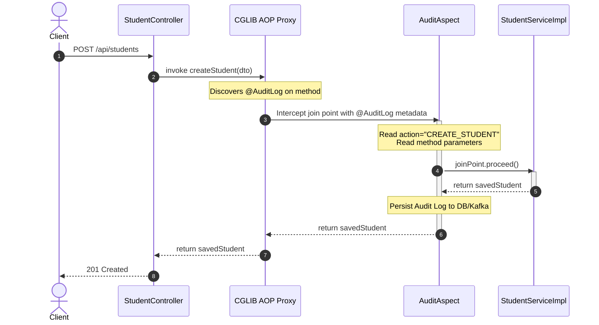

[← Back to Master README](../README.md)

# Custom Annotations in Spring AOP: @annotation Binding & Proxies

This note demonstrates how to combine **Custom Java Annotations** with **Spring AOP** to build clean, declarative, production-grade cross-cutting features like performance tracking, audit logging, and security rate-limiting.

---

## 1. Why Use Custom Annotations with AOP?

Using package or class-level execution pointcuts (`execution(* com.example.service..*(..))`) often leads to:
1. **Fragility**: Renaming or moving packages breaks your pointcut expressions silently.
2. **Over-interception**: Every method in the package is intercepted, even when unnecessary.

**Custom Annotations** invert this control into **Declarative Programming**:
- Developers explicitly tag only the specific methods that require cross-cutting behavior.
- Annotations can carry metadata parameters (e.g., action names, severity levels, performance thresholds).

---

## 2. Architectural Flow: Annotation-Driven AOP



---

## 3. Step 1: Defining the Custom Annotations

Java annotations must specify two critical meta-annotations:
- **`@Retention(RetentionPolicy.RUNTIME)`**: **Crucial!** Keeps the annotation present in the bytecode at runtime so Spring reflection can read it.
- **`@Target(ElementType.METHOD)`**: Restricts usage to methods.

### `@TrackTime.java`
```java
import java.lang.annotation.ElementType;
import java.lang.annotation.Retention;
import java.lang.annotation.RetentionPolicy;
import java.lang.annotation.Target;

@Target(ElementType.METHOD)
@Retention(RetentionPolicy.RUNTIME)
public @interface TrackTime {
    long thresholdMs() default 200; // Alert if execution takes longer than this
}
```

### `@AuditLog.java`
```java
import java.lang.annotation.ElementType;
import java.lang.annotation.Retention;
import java.lang.annotation.RetentionPolicy;
import java.lang.annotation.Target;

@Target(ElementType.METHOD)
@Retention(RetentionPolicy.RUNTIME)
public @interface AuditLog {
    String action();
    boolean logParameters() default true;
}
```

---

## 4. Step 2: Annotating the Business Methods

Developers can now tag methods declaratively:

```java
@Service
public class StudentServiceImpl implements StudentService {

    @Override
    @TrackTime(thresholdMs = 150)
    @AuditLog(action = "CREATE_NEW_STUDENT")
    public CreateStudentResponseDTO createStudent(CreateStudentRequestDTO request) {
        // Business logic...
        return response;
    }
}
```

---

## 5. Step 3: Implementing the Aspect with Parameter Binding

Spring AOP allows binding the annotation instance directly into the advice method arguments:

```java
import org.aspectj.lang.ProceedingJoinPoint;
import org.aspectj.lang.annotation.Around;
import org.aspectj.lang.annotation.Aspect;
import org.aspectj.lang.reflect.MethodSignature;
import org.slf4j.Logger;
import org.slf4j.LoggerFactory;
import org.springframework.stereotype.Component;

import java.util.Arrays;

@Aspect
@Component
public class CustomAnnotationAspect {

    private static final Logger log = LoggerFactory.getLogger(CustomAnnotationAspect.class);

    /**
     * Intercepts any method annotated with @TrackTime.
     * Binds the annotation instance directly to the parameter 'trackTime'.
     */
    @Around("@annotation(trackTime)")
    public Object handleTrackTime(ProceedingJoinPoint joinPoint, TrackTime trackTime) throws Throwable {
        long start = System.currentTimeMillis();
        
        Object result = joinPoint.proceed();
        
        long duration = System.currentTimeMillis() - start;
        String methodName = joinPoint.getSignature().toShortString();

        if (duration > trackTime.thresholdMs()) {
            log.warn("🚨 [Performance Alert] Method {} took {}ms (Threshold: {}ms)", 
                     methodName, duration, trackTime.thresholdMs());
        } else {
            log.info("⏱ [Perf OK] Method {} took {}ms", methodName, duration);
        }

        return result;
    }

    /**
     * Intercepts any method annotated with @AuditLog.
     */
    @Around("@annotation(auditLog)")
    public Object handleAuditLog(ProceedingJoinPoint joinPoint, AuditLog auditLog) throws Throwable {
        MethodSignature signature = (MethodSignature) joinPoint.getSignature();
        String action = auditLog.action();
        Object[] args = joinPoint.getArgs();

        log.info("📝 [Audit Start] Action: {} | Method: {}", action, signature.getName());
        if (auditLog.logParameters()) {
            log.info("   Params: {}", Arrays.toString(args));
        }

        Object result = joinPoint.proceed();

        log.info("✔ [Audit Success] Action: {} completed successfully. Returned: {}", action, result);
        return result;
    }
}
```

---

## 6. Key Pitfall: The Self-Invocation Issue

> [!WARNING]
> **AOP Proxies do not intercept internal `this.method()` calls!**
> If method `A()` calls method `B()` within the same class, and `B()` has `@TrackTime`, **the aspect will NOT execute**!
> 
> **Why?**
> The call from `A()` to `B()` uses the internal `this` reference, bypassing the Spring CGLIB proxy entirely.

```
External Caller ──► [Proxy] ──► Method A() ──► (this.methodB()) ──► Method B()
                      │                            ▲
                      └── Intercepted Here         └── Bypassed! (No Proxy)
```

### Solutions:
1. Move method `B()` into a separate injected service bean.
2. Self-inject the bean via `@Autowired private MyService self;` and call `self.methodB()`.

---

[← Back to Master README](../README.md)
