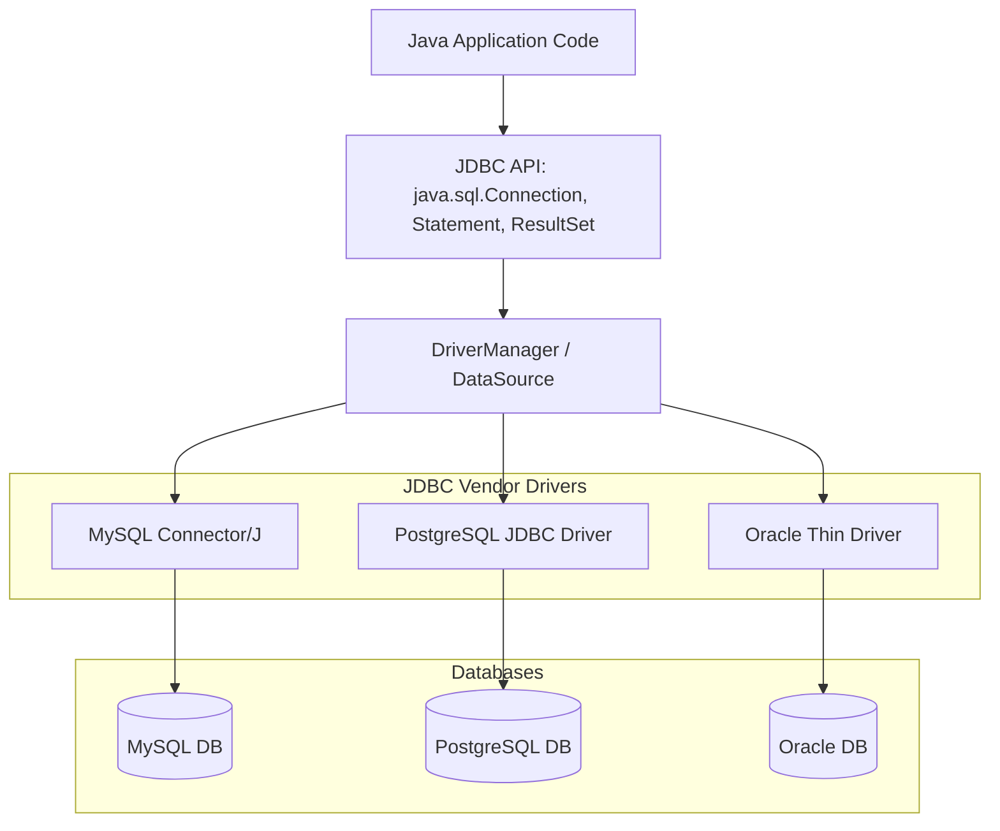

[← Back to Master README](../README.md)

# JDBC in Java from Scratch: Architecture & CRUD Operations

This note explores **Java Database Connectivity (JDBC)** from first principles without frameworks, explaining JDBC drivers, connection management, the danger of SQL injection with `Statement`, and parameterized queries using `PreparedStatement`.

---

## 1. What is JDBC?

**JDBC (Java Database Connectivity)** is a standard Java API (`java.sql` and `javax.sql`) that defines how Java applications interact with relational database management systems (RDBMS) like MySQL, PostgreSQL, and Oracle.

It decouples Java code from database vendor specifics by providing standard interfaces, while database vendors supply the concrete implementations called **JDBC Drivers**.



---

## 2. The 5 Core Steps of a JDBC Operation

Every database interaction using raw JDBC follows five mandatory lifecycle phases:

```
1. Load Driver Class ──► 2. Open Connection ──► 3. Create Statement ──► 4. Execute Query ──► 5. Close Resources
(DriverManager.getConnection)   (PreparedStatement)    (ResultSet / rows)      (try-with-resources)
```

1. **Register Driver**: Modern JDBC 4.0+ drivers register automatically via the Java Service Provider Interface (SPI).
2. **Establish Connection**: Open a physical network socket to the database via `DriverManager.getConnection(url, user, pass)`.
3. **Create Statement**: Prepare an SQL query via `PreparedStatement`.
4. **Execute Query**: Send SQL across the network (`executeQuery()` for SELECT, `executeUpdate()` for INSERT/UPDATE/DELETE).
5. **Process & Close**: Iterate through `ResultSet` and close all connections, statements, and result sets to prevent connection pool starvation.

---

## 3. SQL Injection: `Statement` vs `PreparedStatement`

> [!CAUTION]
> **Never use raw `Statement` with string concatenation!**
> Concatenating user inputs into an SQL string allows attackers to manipulate the SQL syntax itself, bypassing authentication or dropping tables.

### Vulnerable Code (`Statement`):
```java
String query = "SELECT * FROM users WHERE username = '" + userInput + "' AND password = '" + passInput + "'";
// If attacker inputs: ' OR '1'='1
// Resulting SQL: SELECT * FROM users WHERE username = '' OR '1'='1' AND password = ''
// Attacker logs in without credentials!
```

### Safe Code (`PreparedStatement`):
```java
String sql = "SELECT * FROM users WHERE username = ? AND password = ?";
PreparedStatement pstmt = connection.prepareStatement(sql);
pstmt.setString(1, userInput);
pstmt.setString(2, passInput);
```

### Why `PreparedStatement` is Superior:
1. **Security**: The database compiles the SQL query structure **before** binding parameters. User inputs are treated strictly as literal data values, never as executable SQL commands.
2. **Performance**: The DB engine caches the precompiled query plan. Successive queries with different parameters reuse the cached execution plan.

---

## 4. Complete Raw JDBC CRUD Implementation

Below is a complete, production-safe JDBC CRUD class demonstrating `try-with-resources` (`AutoCloseable` ensures connections are closed even during exceptions):

```java
import java.sql.*;
import java.util.ArrayList;
import java.util.List;

public class StudentJdbcDao {

    private static final String URL = "jdbc:postgresql://localhost:5432/students_db";
    private static final String USER = "postgres";
    private static final String PASSWORD = "secretpassword";

    // 1. CREATE: Insert a new Student
    public void insertStudent(String name, String email, int age) {
        String sql = "INSERT INTO students (name, email, age) VALUES (?, ?, ?)";

        try (Connection conn = DriverManager.getConnection(URL, USER, PASSWORD);
             PreparedStatement pstmt = conn.prepareStatement(sql)) {

            pstmt.setString(1, name);
            pstmt.setString(2, email);
            pstmt.setInt(3, age);

            int rowsAffected = pstmt.executeUpdate();
            System.out.println("Inserted rows: " + rowsAffected);

        } catch (SQLException e) {
            e.printStackTrace();
        }
    }

    // 2. READ: Fetch all students
    public List<String> getAllStudentNames() {
        List<String> names = new ArrayList<>();
        String sql = "SELECT name, email FROM students";

        try (Connection conn = DriverManager.getConnection(URL, USER, PASSWORD);
             PreparedStatement pstmt = conn.prepareStatement(sql);
             ResultSet rs = pstmt.executeQuery()) {

            while (rs.next()) {
                String name = rs.getString("name");
                String email = rs.getString("email");
                names.add(name + " (" + email + ")");
            }

        } catch (SQLException e) {
            e.printStackTrace();
        }
        return names;
    }

    // 3. UPDATE: Modify student email
    public void updateEmail(Long id, String newEmail) {
        String sql = "UPDATE students SET email = ? WHERE id = ?";

        try (Connection conn = DriverManager.getConnection(URL, USER, PASSWORD);
             PreparedStatement pstmt = conn.prepareStatement(sql)) {

            pstmt.setString(1, newEmail);
            pstmt.setLong(2, id);

            pstmt.executeUpdate();

        } catch (SQLException e) {
            e.printStackTrace();
        }
    }

    // 4. DELETE: Remove a student
    public void deleteStudent(Long id) {
        String sql = "DELETE FROM students WHERE id = ?";

        try (Connection conn = DriverManager.getConnection(URL, USER, PASSWORD);
             PreparedStatement pstmt = conn.prepareStatement(sql)) {

            pstmt.setLong(1, id);
            pstmt.executeUpdate();

        } catch (SQLException e) {
            e.printStackTrace();
        }
    }
}
```

---

## 5. Major Problems with Raw JDBC

While raw JDBC gives full low-level control, building real-world enterprise applications with it is painful:

1. **Overwhelming Boilerplate**: 80% of the code handles opening connections, closing statements, catching `SQLException`, and mapping `ResultSet` columns.
2. **Inefficient Connection Overhead**: Opening a physical TCP socket to the database on every single request destroys server throughput.
3. **Checked Exception Hell**: Every line forces you to catch or throw checked `SQLException`.
4. **Manual Object Mapping**: You must manually extract each column (`rs.getString()`, `rs.getInt()`) and map it to Java entity fields.

*These pain points directly led to the creation of **Connection Pooling (HikariCP)**, **Spring JdbcTemplate**, and **Hibernate ORM**.*

---

[← Back to Master README](../README.md)
