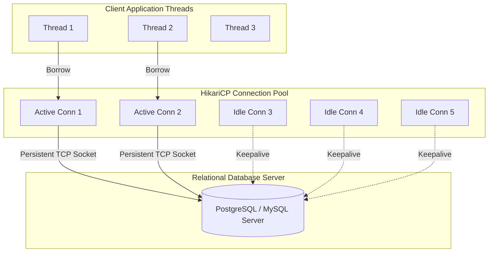

[← Back to Master README](../README.md)

# Spring JDBC: JdbcTemplate, DataSource & HikariCP

This note explains how the Spring Framework abstracts relational databases using **`DataSource`**, high-performance connection pooling with **HikariCP**, and how **`JdbcTemplate`** eliminates JDBC boilerplate while providing automatic exception translation.

---

## 1. What is a `DataSource` & Why Connection Pooling?

In raw JDBC, invoking `DriverManager.getConnection()` opens a new physical TCP socket to the database on **every single request**:
- Establishing a TLS/TCP handshake takes 20ms to 100ms.
- Under high concurrency, opening thousands of connections crashes the database server with `Too many connections` errors.

### The Solution: Connection Pooling
A **Connection Pool** pre-creates a fixed pool of physical database connections at application startup and manages their lifecycle. When an application thread needs a connection:
1. It borrows an idle connection from the pool instantly (0ms network delay).
2. It executes queries.
3. Invoking `connection.close()` does **not** terminate the network socket; it simply returns the connection to the pool for reuse.



---

## 2. HikariCP: The Industry Standard Pool

**HikariCP** is a zero-overhead, ultra-fast production connection pool, configured as the default pool in Spring Boot.

### Essential Configuration (`application.properties`):
```properties
# Basic Connection Info
spring.datasource.url=jdbc:postgresql://localhost:5432/students_db
spring.datasource.username=postgres
spring.datasource.password=secret
spring.datasource.driver-class-name=org.postgresql.Driver

# HikariCP Tuning Parameters
spring.datasource.hikari.maximum-pool-size=10
spring.datasource.hikari.minimum-idle=5
spring.datasource.hikari.idle-timeout=300000        # 5 minutes
spring.datasource.hikari.connection-timeout=20000   # 20 seconds wait time
spring.datasource.hikari.max-lifetime=1800000       # 30 minutes max connection age
spring.datasource.hikari.pool-name=SpringBootHikariCP
```

---

## 3. Spring `JdbcTemplate`

`JdbcTemplate` is the central class in the Spring JDBC core package. It executes SQL queries, updates, and stored procedures while automatically managing connection acquisition and release.

### Key Capabilities of `JdbcTemplate`:
1. **Automated Resource Management**: Acquires connections from `DataSource` and guarantees they are returned to the pool, eliminating resource leaks.
2. **Exception Translation**: Catches vendor-specific checked `SQLException` and translates it into Spring's descriptive, unchecked **`DataAccessException`** hierarchy (e.g., `DuplicateKeyException`, `BadSqlGrammarException`, `DataIntegrityViolationException`).
3. **Clean Mapping API**: Maps SQL rows directly to domain objects using `RowMapper<T>`.

---

## 4. `RowMapper` vs `BeanPropertyRowMapper`

### A. Custom `RowMapper<T>` (Fastest & Flexible)
Maps each row of a `ResultSet` to a Java object explicitly:

```java
import org.springframework.jdbc.core.RowMapper;
import java.sql.ResultSet;
import java.sql.SQLException;

public class StudentRowMapper implements RowMapper<Student> {
    @Override
    public Student mapRow(ResultSet rs, int rowNum) throws SQLException {
        Student student = new Student();
        student.setId(rs.getLong("id"));
        student.setName(rs.getString("name"));
        student.setEmail(rs.getString("email"));
        student.setAge(rs.getInt("age"));
        return student;
    }
}
```

### B. `BeanPropertyRowMapper<T>` (Reflection-based)
Automatically maps table columns (e.g. `first_name`) to camelCase Java properties (`firstName`).
```java
RowMapper<Student> mapper = BeanPropertyRowMapper.newInstance(Student.class);
```

---

## 5. Complete CRUD with `JdbcTemplate`

```java
import org.springframework.dao.EmptyResultDataAccessException;
import org.springframework.jdbc.core.JdbcTemplate;
import org.springframework.stereotype.Repository;

import java.util.List;
import java.util.Optional;

@Repository
public class StudentJdbcTemplateRepository {

    private final JdbcTemplate jdbcTemplate;
    private final StudentRowMapper rowMapper = new StudentRowMapper();

    public StudentJdbcTemplateRepository(JdbcTemplate jdbcTemplate) {
        this.jdbcTemplate = jdbcTemplate;
    }

    // 1. CREATE
    public int save(Student student) {
        String sql = "INSERT INTO students (name, email, age) VALUES (?, ?, ?)";
        return jdbcTemplate.update(sql, student.getName(), student.getEmail(), student.getAge());
    }

    // 2. READ (Single record with Optional handling)
    public Optional<Student> findById(Long id) {
        String sql = "SELECT id, name, email, age FROM students WHERE id = ?";
        try {
            Student student = jdbcTemplate.queryForObject(sql, rowMapper, id);
            return Optional.ofNullable(student);
        } catch (EmptyResultDataAccessException e) {
            return Optional.empty();
        }
    }

    // 3. READ (All records)
    public List<Student> findAll() {
        String sql = "SELECT id, name, email, age FROM students";
        return jdbcTemplate.query(sql, rowMapper);
    }

    // 4. UPDATE
    public int update(Student student) {
        String sql = "UPDATE students SET name = ?, email = ?, age = ? WHERE id = ?";
        return jdbcTemplate.update(sql, student.getName(), student.getEmail(), student.getAge(), student.getId());
    }

    // 5. DELETE
    public int deleteById(Long id) {
        String sql = "DELETE FROM students WHERE id = ?";
        return jdbcTemplate.update(sql, id);
    }
}
```

---

## 6. Architectural Comparison

| Dimension | Raw JDBC | Spring `JdbcTemplate` | Spring Data JPA / Hibernate |
| :--- | :--- | :--- | :--- |
| **Boilerplate** | Maximum (open, close, try-catch, loop) | Low (SQL queries + RowMapper) | Minimal (No SQL required for basic CRUD) |
| **Control** | Full control over raw SQL & driver | Full control over raw SQL execution | Abstraction via ORM / JPQL |
| **Object Relational Mapping** | 100% manual | Manual via `RowMapper` | Automated via `@Entity` & relationships |
| **Caching & Dirty Checking** | None | None | L1 Cache, L2 Cache, Auto Dirty Checking |
| **Best Used For** | Educational understanding | High-performance reporting, batch jobs, complex SQL queries | Standard enterprise domain models & rapid CRUD |

---

[← Back to Master README](../README.md)
